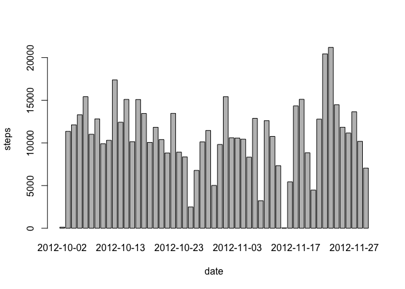
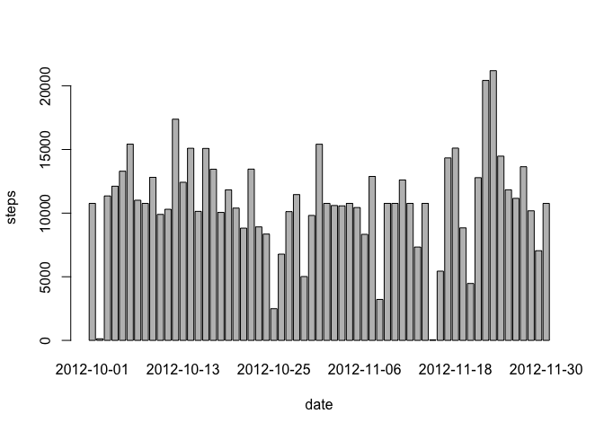

# Reproducible Research: Peer Assessment 1

## Loading and preprocessing the data


```r
# load "data.table" to use fread
library(data.table) 

# create data directory if it doesn't exist
if (!file.exists("data")){
  dir.create("data")
}

if (!file.exists("data/activity.csv")){
  # specify file url
  url = "https://d396qusza40orc.cloudfront.net/repdata%2Fdata%2Factivity.zip"

  # create a temporary directory
  td = tempdir()
  # create the placeholder file
  tf = tempfile(tmpdir=td, fileext=".zip")
  # download into the placeholder file
  download.file(url, tf, method="curl")

  # get the name of the first file in the zip archive
  fname = unzip(tf, list=TRUE)$Name[1]
  
  # create data path
  dp = paste(file.path(getwd()),"/data",sep="")
  # unzip the file to the data directory
  unzip(tf, files=fname, exdir=dp, overwrite=TRUE)
}

# create file path
fpath = paste(file.path(getwd()),"/data/","activity.csv",sep="")

# read the selected data into memory
activity <- fread(fpath, sep=",", header=TRUE, na.strings="NA")

# Convert date to proper date format
activity$date <- as.Date(activity$date, "%Y-%m-%d")
```

## What is mean total number of steps taken per day?

1. Make a histogram of the total number of steps taken each day


```r
dailysteps <- aggregate(steps ~ date, data=activity, FUN=sum)
barplot(dailysteps$steps, names.arg=dailysteps$date, xlab="date", ylab="steps")
```

 

2. Calculate and report the **mean** and **median** total number of steps taken per day


```r
mean(dailysteps$steps)
```

```
## [1] 10766.19
```

```r
median(dailysteps$steps)
```

```
## [1] 10765
```

## What is the average daily activity pattern?

1. Make a time series plot (i.e. `type = "l"`) of the 5-minute
   interval (x-axis) and the average number of steps taken, averaged
   across all days (y-axis)


```r
intervalactivity <- aggregate(steps ~ interval, data=activity, FUN=mean)
plot(intervalactivity, type="l")
```

 

2. Which 5-minute interval, on average across all the days in the
   dataset, contains the maximum number of steps?


```r
intervalactivity$interval[which.max(intervalactivity$steps)]
```

```
## [1] 835
```

## Imputing missing values

1. Calculate and report the total number of missing values in the
   dataset (i.e. the total number of rows with `NA`s)


```r
sum(is.na(activity))
```

```
## [1] 2304
```

2. Devise a strategy for filling in all of the missing values in the
   dataset. The strategy does not need to be sophisticated. For
   example, you could use the mean/median for that day, or the mean
   for that 5-minute interval, etc.

The means of the associate 5-minute intervals will be used to fill missing values.

3. Create a new dataset that is equal to the original dataset but with
   the missing data filled in.


```r
activity <- merge(activity, intervalactivity, by="interval", suffixes=c("",".y"))
na_values <- is.na(activity$steps)
activity$steps[na_values] <- activity$steps.y[na_values]
```

4. Make a histogram of the total number of steps taken each day and
   Calculate and report the **mean** and **median** total number of
   steps taken per day. Do these values differ from the estimates from
   the first part of the assignment? What is the impact of imputing
   missing data on the estimates of the total daily number of steps?


```r
dailysteps <- aggregate(steps ~ date, data=activity, FUN=sum)
barplot(dailysteps$steps, names.arg=dailysteps$date, xlab="date", ylab="steps")
```

 

```r
mean(dailysteps$steps)
```

```
## [1] 10766.19
```

```r
median(dailysteps$steps)
```

```
## [1] 10766.19
```

The impact of imputing missing data on the estimates of the total daily number of steps seems to be unsignificantly low.

## Are there differences in activity patterns between weekdays and weekends?

1. Create a new factor variable in the dataset with two levels --
   "weekday" and "weekend" indicating whether a given date is a
   weekday or weekend day.


```r
daytype <- function(date) {
    if (weekdays(as.Date(date)) %in% c("Saturday", "Sunday")) {
        "weekend"
    } else {
        "weekday"
    }
}
activity$daytype <- as.factor(sapply(activity$date, daytype))
```

2. Make a panel plot containing a time series plot (i.e. `type = "l"`)
   of the 5-minute interval (x-axis) and the average number of steps
   taken, averaged across all weekday days or weekend days
   (y-axis).


```r
par(mfrow=c(2,1))
for (type in c("weekend", "weekday")) {
    activitytype <- aggregate(steps ~ interval,
                            data=activity,
                            subset=activity$daytype==type,
                            FUN=mean)
    plot(activitytype, type="l", main=type)
}
```

 
